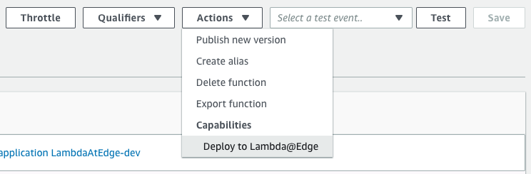
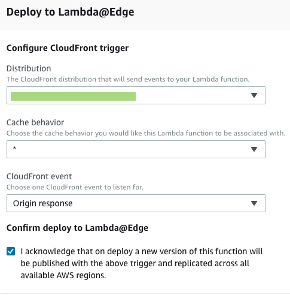

# Example Node.JS Lambda@Edge cache-control app

A simple application written in Node.JS with the serverless framework that runs on AWS Lambda@Edge.
It adds `Cache-control: max-age=n,public` header to object that are missing the `cache-control` header.

## Requirements

 - An AWS account that is set up
 - A cloudfront distribution (as we would like to trigger it on `origin-response`)
 - [Serverless framework](https://serverless.com/framework/docs/getting-started/)

 ## IAM Role for the function

 The function has a very basic IAM role set up that will be created by `serverless`. The role has access to write to CloudWatch logs and it can be assumed by `lambda` and `edgelambda` services. For production, the logs should be more restrictive than the AWS managed `AWSLambdaBasicExecutionRole`.

 ## How to deploy

 Set up a profile that has access to create cloudformation templates, access S3 etc. Please check the relevant [documentation of serverless](https://serverless.com/framework/docs/providers/aws/guide/credentials/).

```bash
serverless deploy --aws-profile=my-profile-name
```

The command above will deploy the lambda function. For Lambda@Edge it is important to deploy to `us-east-1` as that is where the function will be distributed to CloudFront.

## Trigger from CloudFront

On the AWS console for Lambda, find the function and click on _Deploy to Lambda@Edge_. On the next screen you will need to select which distrbitution you are deploying to and on which event, select `origin-response` event.

### First step


### Second step


After the function is deployed make a request to an asset on the CloudFront distribution of yours (deployment might take some time). If the header doesn't seem to be set please check CloudWatch logs.

Note that the logs will be written to a region that is close to the CDN edge node that is serving you. For example even though the Lambda is in `us-east-1` it is now deployed throughout the distribution and if you are in France for example the logs of the edge function will be written to the Paris region.
